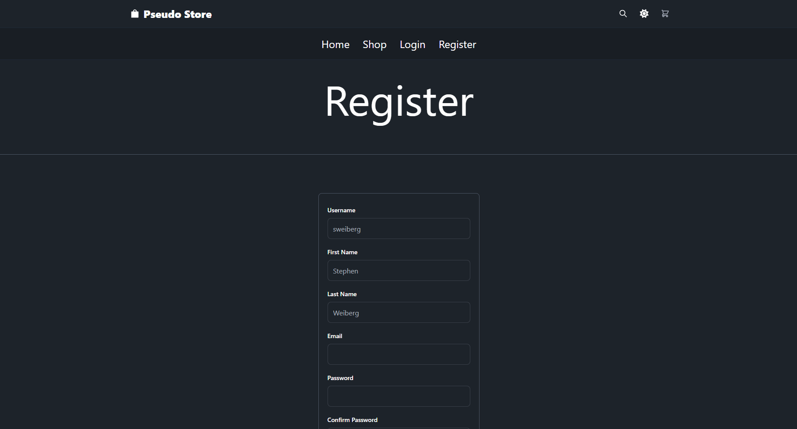
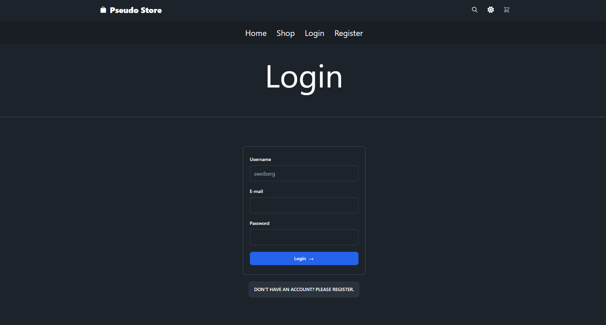
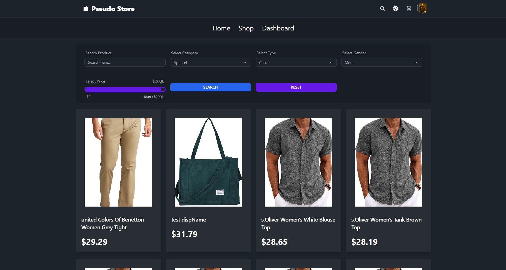
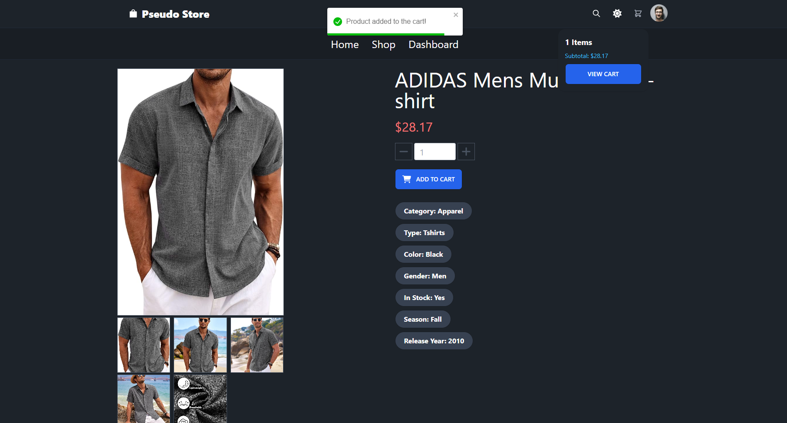
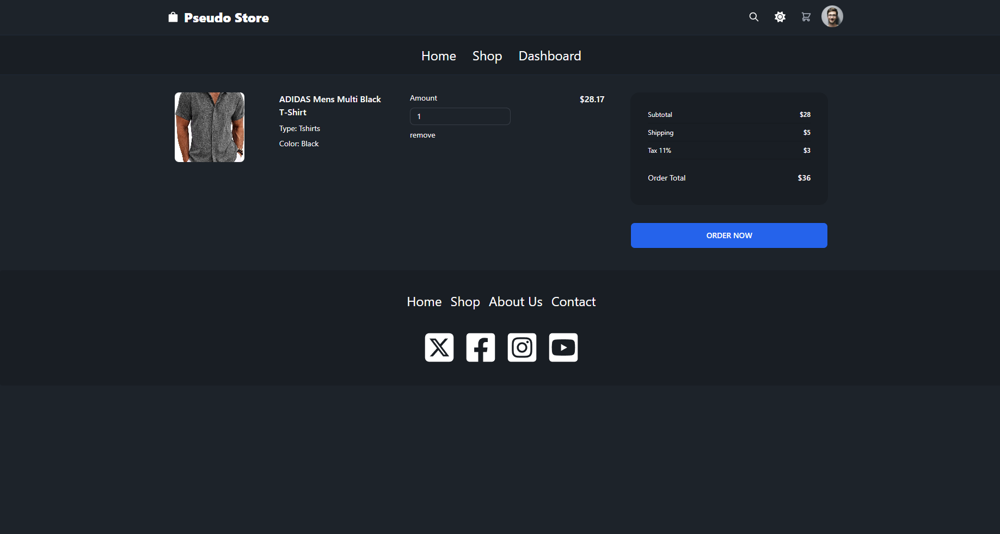
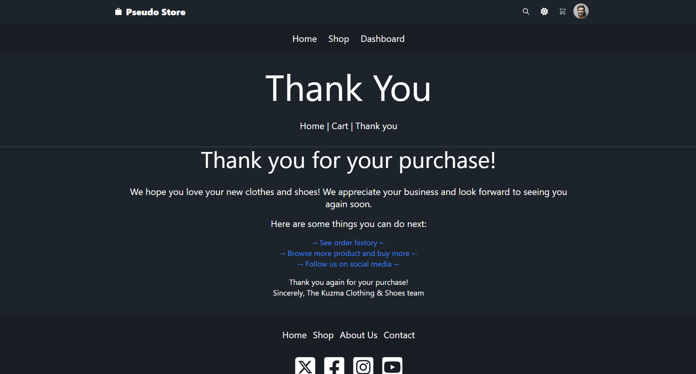
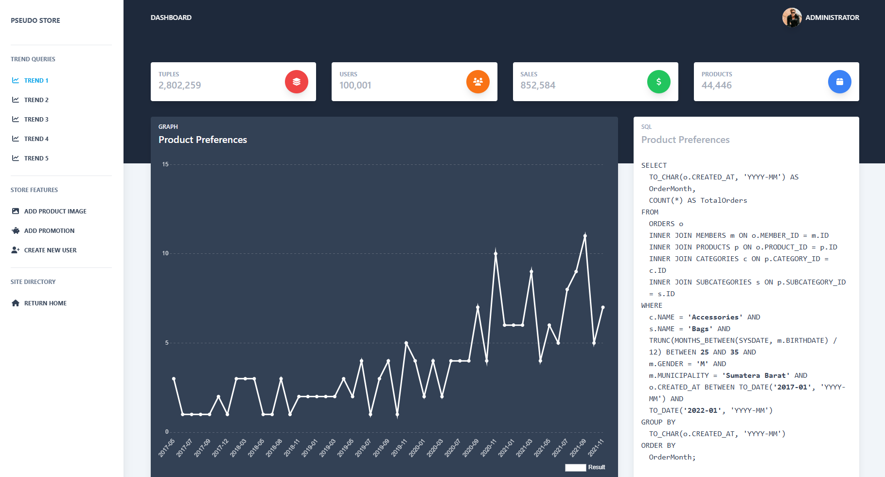

# Pseudo-Store
The frontend UI design is by [BlueSky428](https://github.com/BlueSky428/Clothing-eCommerce-Shop), but the javascript was heavily modified to incorporate the backend Go server's functionality. 

Built using Golang, Oracle Database and incorporates Stripe's API.

## Homepage

## Registration

## Login

## Search

## Product Page

## Checkout

## Admin Dashboard

